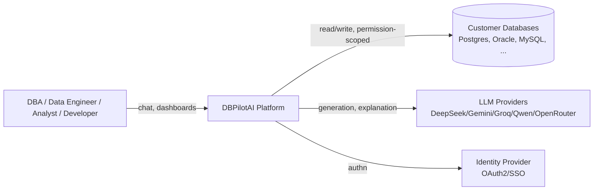
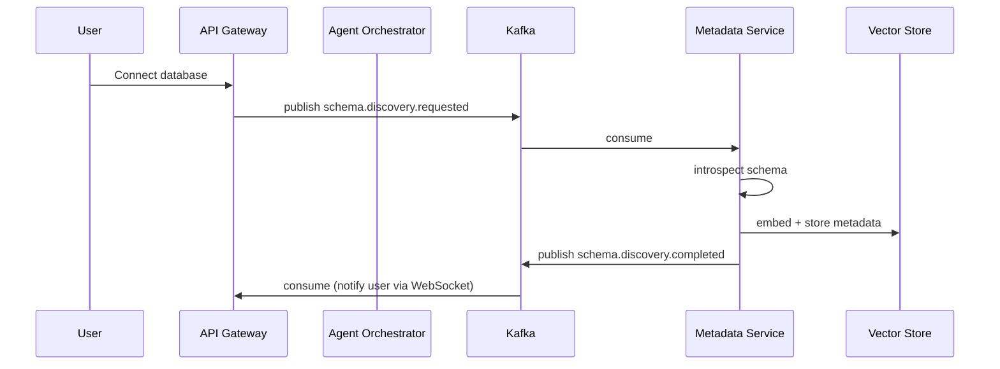
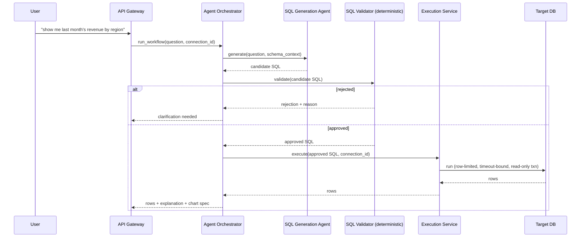

# ARCHITECTURE.md

Target system architecture for DBPilotAI. See [CLAUDE.md](CLAUDE.md) for what's actually implemented today vs. this target. Stack: Python/FastAPI backend, React/Next.js frontend — no Java/Spring.

## System Context (C4 Level 1)

## Containers (C4 Level 2)

| Container | Responsibility | Tech |
|---|---|---|
| Web App | Chat UI, schema explorer, dashboards, voice input | Next.js/React/TypeScript |
| API Gateway/BFF | AuthN/Z, request routing, rate limiting, WebSocket/SSE streaming | FastAPI |
| Agent Orchestration Service | Coordinates agent workflows, enforces budgets | FastAPI + async workers |
| AI Gateway | LLM provider abstraction, failover, retry, circuit breaking | `app/ai/` (already built) |
| Metadata Service | Schema discovery, metadata storage, knowledge graph | FastAPI + SQLAlchemy + graph store |
| Execution Service | Sandboxed SQL execution against target databases | FastAPI + per-engine drivers |
| Event Bus | Async decoupling for discovery/indexing/long-running workflows | Kafka |
| App Database | Tenants, connections (encrypted), conversations, audit log | PostgreSQL |
| Vector Store | Embeddings for RAG over metadata/docs | pgvector or Qdrant |
| Cache | Schema/metadata/session cache | Redis |
| Object Storage | Large artifacts (exports, reports) | S3 |

## Services & Responsibilities

- **API Gateway/BFF** — the only container the frontend talks to directly; never exposes internal services.
- **Agent Orchestration Service** — owns workflow lifecycle (start/pause/resume/cancel), budget enforcement, and the fan-out to individual agents (see [AI_ARCHITECTURE.md](AI_ARCHITECTURE.md), [AGENTS.md](AGENTS.md)).
- **AI Gateway** — the only container allowed to call an external LLM provider. Every agent's "call the model" step routes through it.
- **Metadata Service** — owns the Metadata bounded context ([DOMAIN.md](DOMAIN.md)): schema structure, statistics, lineage, glossary, knowledge graph.
- **Execution Service** — owns the Execution bounded context: the only container with a live connection to a customer's target database at query time. Isolated so a compromise here can't reach app-database credentials or other tenants' connections.

## Dependencies

- Agent Orchestration Service depends on AI Gateway and Metadata Service; never calls Execution Service directly without going through the SQL Validator gate.
- Metadata Service depends on Vector Store + Cache; publishes discovery-complete events to Kafka.
- Execution Service depends only on per-tenant connection credentials (fetched, decrypted, used, discarded — never cached in plaintext).

## Event Flows

Kafka is used only where genuine async decoupling or fan-out is needed (see [EVENTS.md](EVENTS.md) for the full topic list and the criteria for "does this need to be an event"):

## Data Flows (NL-to-SQL, request/response — not eventified)

## Communication Patterns

- **Synchronous (HTTP/gRPC-internal)**: user-facing request/response (chat turn, dashboard load) — latency-sensitive, stays synchronous.
- **Asynchronous (Kafka)**: schema discovery, bulk re-indexing, long-running migration-assist workflows — anything that can legitimately take longer than a user is willing to wait synchronously.
- **Streaming (SSE/WebSocket)**: agent progress, token-by-token generation.

## Failure Handling

- Every external call (LLM provider, target DB, Kafka) goes through a circuit breaker + typed failure + retry-only-for-transient-errors — the pattern already proven in `app/ai/` extends to Metadata/Execution service calls.
- Agent workflows fail closed: a workflow that can't get a validated SQL statement returns "I need more information," never a best-guess unvalidated query.
- Kafka consumer failures go to a per-topic DLQ with alerting, not silent drops (see [EVENTS.md](EVENTS.md)).

## Scalability Strategy

Two independent scaling axes, sized separately:
1. **Control plane** (API Gateway, Agent Orchestrator, app DB) — scales with tenant count and request volume; horizontal, stateless, standard autoscaling.
2. **Data plane** (Metadata Service discovery jobs, Vector Store indexing) — scales with schema size per job, bursty; runs as Kafka-consumed background workers that can scale independently and queue during spikes rather than blocking the control plane.

## HA Architecture

- Stateless API/orchestrator containers behind a load balancer, multi-AZ.
- App DB: managed Postgres with read replica(s) + automated failover.
- Kafka: multi-broker, replication factor ≥ 3 for production topics.
- AI Gateway's own multi-provider failover is itself an HA mechanism for the LLM dependency — no single LLM provider outage takes down generation.

## Disaster Recovery

- App DB: point-in-time recovery + cross-region backup snapshot.
- Encrypted connection credentials: backup the encryption key material separately from the encrypted data (per [SECURITY.md](SECURITY.md)) — losing the key is equivalent to losing all stored credentials.
- RPO/RTO targets and DR drill cadence: defined per tenant SLA tier once multi-tenancy billing exists ([MULTITENANCY.md](MULTITENANCY.md)) — not needed for MVP/single-tenant-shaped early phases.
