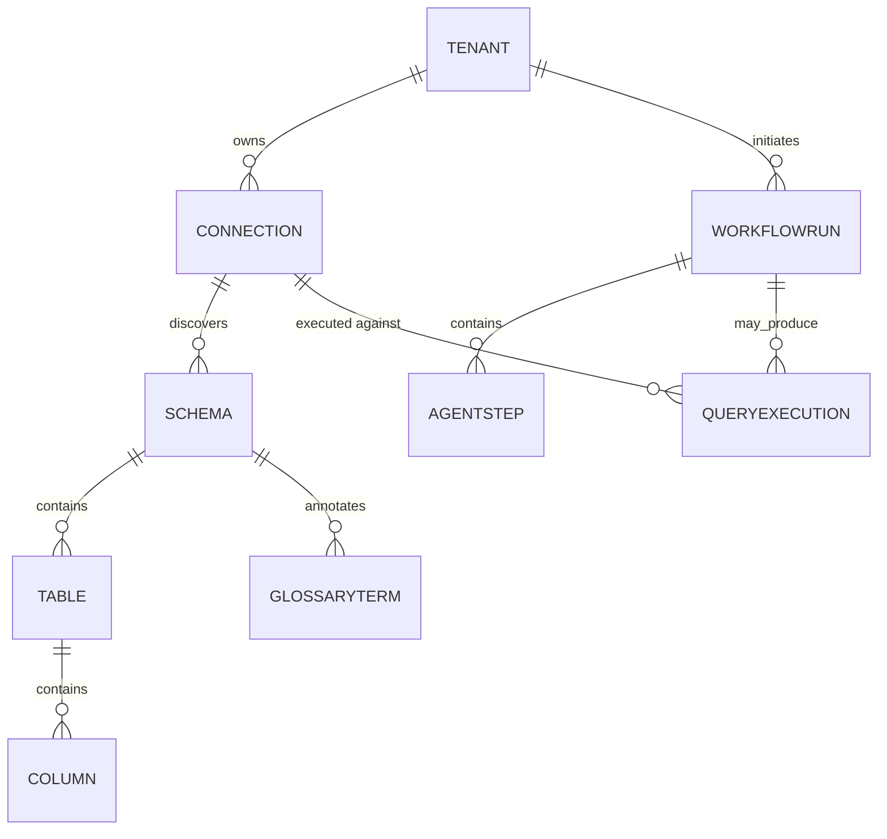

# DOMAIN.md

Domain-Driven Design model for DBPilotAI. This is the contract new backend code should structure itself around (`domain/` → `application/` → `adapters/` per [CLAUDE.md](CLAUDE.md)'s Engineering Principles).

## Business Capabilities

Database onboarding, connection management, schema discovery, metadata extraction, knowledge graph generation, NL-to-SQL, query optimization, database observability, root cause analysis, data quality analysis, database documentation, migration assistance, workflow automation, agent orchestration, RAG over database metadata, enterprise governance, multi-tenancy, security and auditing.

## Bounded Contexts

Three core contexts, deliberately kept separate (see PART 1 analysis in the session that generated this doc — collapsing them into one "database" concept is the single most tempting, most damaging shortcut):

| Context | Owns | Never owns |
|---|---|---|
| **Connection** | Credentials, network reachability, driver dialect, connection health | Schema structure, query results |
| **Metadata** | Schema structure, statistics, lineage, business glossary, knowledge graph, embeddings | Live credentials, query execution |
| **Execution** | Actual query runs, result sets, execution audit log | Long-term credential storage (fetches per-use, discards) |

Supporting contexts: **Agent Orchestration** (workflow lifecycle, budgets), **Tenancy** (tenant, quota, billing), **Identity** (users, roles, sessions).

## Aggregates & Entities

### Connection context
- **Connection** (aggregate root) — id, tenant_id, engine_type, encrypted_credential_ref, status, last_health_check_at.
- **CredentialSecret** (value object, never serialized whole — only a reference to the encrypted material lives on Connection).

### Metadata context
- **Schema** (aggregate root) — id, connection_id, tenant_id, discovered_at, version.
  - **Table** (entity, child of Schema) — name, row_count_estimate, columns, indexes, foreign_keys.
  - **Column** (value object) — name, type, nullable, is_pk, is_fk.
  - **GlossaryTerm** (entity) — business-friendly name/description mapped to a Table/Column.
  - **LineageEdge** (entity) — source Table/Column → derived Table/Column relationship.
- **MetadataEmbedding** (aggregate root, in Vector Store) — schema_element_ref, embedding_vector, chunk_text.

### Execution context
- **QueryExecution** (aggregate root) — id, tenant_id, connection_id, validated_sql, status, row_count, duration_ms, requested_by.
- **ExecutionAuditEntry** (entity) — immutable append-only record of every attempted execution (approved or rejected), for compliance.

### Agent Orchestration context
- **WorkflowRun** (aggregate root) — id, tenant_id, workflow_type, status, budget (max_depth/max_cost/max_duration), steps[].
- **AgentStep** (entity, child of WorkflowRun) — agent_name, input, output, tool_calls[], status.

### Tenancy context
- **Tenant** (aggregate root) — id, name, tier, quota_limits, status.
- **Quota** (value object) — max_connections, max_monthly_queries, max_agent_workflow_cost.

## Domain Services

- **SchemaDiscoveryService** — orchestrates introspection across engine-specific drivers, normalizes into the Metadata context's shape.
- **SqlValidationService** — deterministic, non-LLM-trusting gate; the only thing standing between a generated statement and Execution (see [SECURITY.md](SECURITY.md)).
- **CredentialEncryptionService** — envelope encryption/decryption for Connection credentials (see [SECURITY.md](SECURITY.md), [MULTITENANCY.md](MULTITENANCY.md)).
- **BudgetEnforcementService** — checks a WorkflowRun's cumulative cost/depth/duration against its budget before allowing the next AgentStep.

## Domain Events

(Full contracts in [EVENTS.md](EVENTS.md); this is the domain-level list.)

`ConnectionRegistered`, `ConnectionHealthChanged`, `SchemaDiscoveryRequested`, `SchemaDiscoveryCompleted`, `SchemaDiscoveryFailed`, `MetadataEmbeddingIndexed`, `SqlGenerated`, `SqlValidationRejected`, `SqlValidationApproved`, `QueryExecutionStarted`, `QueryExecutionCompleted`, `QueryExecutionFailed`, `WorkflowRunStarted`, `WorkflowBudgetExceeded`, `WorkflowRunCompleted`.

## Invariants

- A `Connection`'s credential is never readable in plaintext outside `CredentialEncryptionService`'s decrypt call, and that call's result is never logged, cached, or included in an LLM prompt.
- A `QueryExecution` cannot exist without a corresponding `SqlValidationApproved` event — there is no code path that executes unvalidated SQL.
- Every `Schema`, `Connection`, `WorkflowRun`, and `QueryExecution` carries `tenant_id`; a query missing a tenant scope is a bug, not an edge case, at every repository method.
- A `WorkflowRun` cannot exceed its `Quota`-derived budget; `BudgetEnforcementService` checks before, not after, each step.

## Relationships

