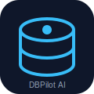
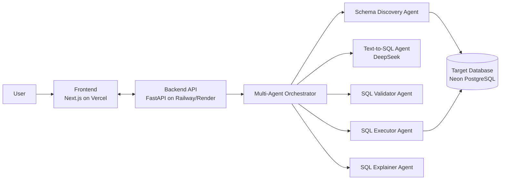

<div align="center">

<!-- TODO: replace with hosted logo, e.g. docs/assets/logo.png -->


# DBPilot AI

**Your AI Copilot for Databases**

[](https://github.com/anjinapp-aryan/DBPilot-AI/actions/workflows/build.yml)
[](https://github.com/anjinapp-aryan/DBPilot-AI/actions/workflows/backend-tests.yml)
[](https://github.com/anjinapp-aryan/DBPilot-AI/actions/workflows/frontend-tests.yml)
[](https://github.com/anjinapp-aryan/DBPilot-AI/actions/workflows/lint.yml)
[](LICENSE)

[Live Demo](#) · [Documentation](docs/) · [Report a Bug](https://github.com/anjinapp-aryan/DBPilot-AI/issues) · [Request a Feature](https://github.com/anjinapp-aryan/DBPilot-AI/issues)

</div>

---

## Screenshots

> Screenshots will be added as the UI is built out (see [roadmap](docs/roadmap.md)).

| Chat-to-SQL | Schema Explorer | Auto Chart |
|---|---|---|
| _coming soon_ | _coming soon_ | _coming soon_ |

## What is DBPilot AI?

DBPilot AI is an open-source AI copilot that sits on top of your database and
lets you **talk to your data**. Connect a database, ask a question in plain
English, and DBPilot AI discovers the schema, generates safe SQL, validates
and explains it before running it, executes it, and turns the result into a
chart or a conversational answer — with voice input and a full audit trail.

It is built as a transparent, inspectable multi-agent system rather than a
single opaque prompt, so every step (schema discovery → SQL generation →
validation → execution → explanation) is a distinct, testable component.

## Features

- **Schema Discovery** — automatically introspects PostgreSQL databases (tables, columns, foreign keys, indexes) to ground the AI in your real schema.
- **Text-to-SQL** — natural language to SQL via DeepSeek, with conversational memory across turns.
- **SQL Safety Validation** — a dedicated validator agent blocks destructive/unsafe statements before anything touches your database.
- **SQL Execution** — sandboxed, read-oriented execution with row limits and timeouts.
- **SQL Explanation / Tutor Mode** — plain-English explanations of generated SQL to help you learn, not just consume output.
- **Voice Input** — ask questions with your voice using the browser's speech recognition APIs.
- **Automatic Visualization** — results are automatically charted when appropriate.
- **Multi-Agent Orchestration** — discovery, generation, validation, execution, and explanation are coordinated as separate agents with clear responsibilities.

See the full breakdown in [docs/agents.md](docs/agents.md).

## Architecture

High-level system architecture — see [architecture/system-architecture.md](architecture/system-architecture.md) and [docs/architecture.md](docs/architecture.md) for details.



## Tech Stack

| Layer | Technology |
|---|---|
| Frontend | Next.js (App Router), TypeScript, React |
| Backend | Python, FastAPI |
| Database | PostgreSQL (Neon), SQLAlchemy |
| LLM Provider | DeepSeek (primary), with automatic failover to Gemini, Groq, Qwen, OpenRouter |
| Frontend Hosting | Vercel |
| Backend Hosting | Railway / Render |
| CI/CD | GitHub Actions |

## Repository Structure

```text
DBPilot-AI/
├── .github/         # CI workflows, issue/PR templates
├── docs/            # architecture, api, database, agents, deployment, security, roadmap docs
├── architecture/    # architecture diagrams
├── frontend/        # Next.js application
├── backend/         # FastAPI application
├── database/        # schema/migration references
├── prompts/         # LLM prompt templates
├── agents/          # agent specs / orchestration configuration
├── scripts/         # dev & setup scripts
├── tests/           # cross-cutting / e2e tests
├── deployment/       # Vercel / Railway / Render / docker-compose configs
└── examples/        # example queries and walkthroughs
```

## Installation

### Prerequisites

- Node.js 20+
- Python 3.11+
- A PostgreSQL database (e.g. a free [Neon](https://neon.tech) project)
- A [DeepSeek](https://platform.deepseek.com) API key

### Clone

```bash
git clone https://github.com/anjinapp-aryan/DBPilot-AI.git
cd DBPilot-AI
```

## Local Development

### 1. Backend

```bash
cd backend
python -m venv .venv
. .venv/Scripts/activate        # Windows (PowerShell: .venv\Scripts\Activate.ps1)
# source .venv/bin/activate      # macOS/Linux
pip install -r requirements.txt
cp ../.env.example .env         # then fill in DATABASE_URL + at least one AI provider key
uvicorn app.main:app --reload --port 8000
```

Backend runs at `http://localhost:8000` (health check at `/health`, docs at `/docs`).

### 2. Frontend

```bash
cd frontend
npm install
cp ../.env.example .env.local   # then set NEXT_PUBLIC_API_BASE_URL
npm run dev
```

Frontend runs at `http://localhost:3000`.

### 3. Or run both with Docker Compose

```bash
docker compose -f deployment/docker-compose.yml up --build
```

See [scripts/](scripts/) for one-shot setup scripts.

## Deployment

DBPilot AI is designed to run entirely on free tiers:

- **Frontend** → [Vercel](https://vercel.com)
- **Backend** → [Railway](https://railway.app) or [Render](https://render.com)
- **Database** → [Neon PostgreSQL](https://neon.tech)

Full deployment guide: [docs/deployment.md](docs/deployment.md).

## Environment Variables

See [.env.example](.env.example) for the complete list. Key variables:

| Variable | Description |
|---|---|
| `DATABASE_URL` | Connection string for the target/app PostgreSQL database |
| `PRIMARY_PROVIDER` / `AI_PROVIDER_ORDER` | Preferred LLM provider and failover chain (DeepSeek → Gemini → Groq → Qwen → OpenRouter) |
| `DEEP_SHEEK_NVIDIA_API_KEY`, `GEMINI_API_KEY`, `GROQ_API_KEY`, `QWEN3_NVIDIA_API_KEY`, `OPENROUTER_API_KEY` | Per-provider API keys — the gateway skips any provider whose key/model isn't set |
| `NEXT_PUBLIC_API_BASE_URL` | URL the frontend uses to reach the backend API |
| `ALLOWED_ORIGINS` | CORS allow-list for the backend |
| `SECRET_KEY` | Backend secret for signing/session use |

## Examples

Example natural-language-to-SQL walkthroughs will be added under
[examples/](examples/) as the text-to-SQL agent lands (Phase 3).

## Roadmap

| Phase | Milestone | Status |
|---|---|---|
| 1 | Project bootstrap | ✅ In progress |
| 2 | Schema discovery | ⬜ Planned |
| 3 | Text-to-SQL | ⬜ Planned |
| 4 | SQL validation | ⬜ Planned |
| 5 | SQL execution | ⬜ Planned |
| 6 | SQL explanation | ⬜ Planned |
| 7 | Voice support | ⬜ Planned |
| 8 | Visualization | ⬜ Planned |
| 9 | Multi-agent orchestration | ⬜ Planned |
| 10 | Production deployment | ⬜ Planned |

Full detail: [docs/roadmap.md](docs/roadmap.md).

## Contributing

Contributions are welcome! Please read [CONTRIBUTING.md](CONTRIBUTING.md) and
[docs/contributing.md](docs/contributing.md) for coding standards, branch
naming, and the PR process. This project follows the
[Contributor Covenant](CODE_OF_CONDUCT.md).

## Security

Please see [SECURITY.md](SECURITY.md) and [docs/security.md](docs/security.md)
before reporting vulnerabilities or connecting production databases.

## License

Licensed under the [MIT License](LICENSE).
