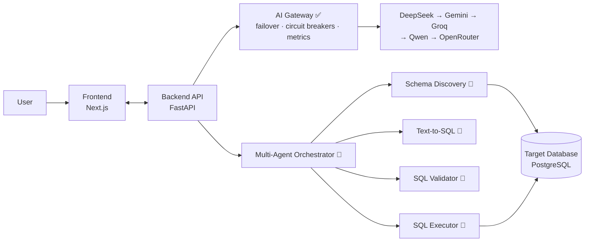

<div align="center">

<!-- TODO: replace with hosted logo, e.g. docs/assets/logo.png -->


# DBPilot AI

**Your AI Copilot for Databases**

[](https://github.com/anjinapp-aryan/DBPilot-AI/actions/workflows/build.yml)
[](https://github.com/anjinapp-aryan/DBPilot-AI/actions/workflows/backend-tests.yml)
[](https://github.com/anjinapp-aryan/DBPilot-AI/actions/workflows/frontend-tests.yml)
[](https://github.com/anjinapp-aryan/DBPilot-AI/actions/workflows/lint.yml)
[](LICENSE)

[Documentation](docs/) · [Report a Bug](https://github.com/anjinapp-aryan/DBPilot-AI/issues) · [Request a Feature](https://github.com/anjinapp-aryan/DBPilot-AI/issues)

</div>

---

## What is DBPilot AI?

DBPilot AI is an open-source AI copilot that sits on top of your database and
lets you **talk to your data**. Connect a database, ask a question in plain
English, and DBPilot AI discovers the schema, generates safe SQL, validates
and explains it before running it, executes it, and turns the result into a
chart or a conversational answer — with a full audit trail.

It is built as a transparent, inspectable multi-agent system rather than a
single opaque prompt, so every step (schema discovery → SQL generation →
validation → execution → explanation) is a distinct, testable component.

> **Project status:** early-stage and under active development. The
> foundation (FastAPI backend, Next.js frontend, CI) and the **AI Gateway**
> — a production-grade multi-provider LLM layer with automatic failover —
> are built. Database-facing features (schema discovery, text-to-SQL,
> query execution) are the next phases. See [Roadmap](#roadmap) for exactly
> what works today.

## What's built today

### ✅ AI Gateway (`backend/app/ai/`)

Every LLM call in the platform goes through a single resilient gateway —
no agent or route ever talks to a provider SDK directly:

- **Multi-provider failover chain:** DeepSeek (NVIDIA-hosted) → Gemini →
  Groq → Qwen (NVIDIA-hosted) → OpenRouter, configurable via
  `AI_PROVIDER_ORDER`. Providers without an API key + model configured are
  skipped automatically.
- **Per-provider circuit breakers** that open after repeated failures and
  half-open after a cooldown.
- **Smart retries** — transient network errors are retried; quota/429
  errors fail over to the next provider immediately.
- **Health tracking & metrics** exposed at
  `GET /api/v1/ai/health`, `/api/v1/ai/providers`, `/api/v1/ai/stats`.
- **Chat endpoint:** `POST /api/v1/ai/chat`.

### ✅ Platform foundation

- Structured JSON logging (structlog) with request/trace-ID correlation
  middleware.
- Centralized exception handling with a single JSON error envelope.
- Dependency-injection container (`app/core/dependencies.py`) — everything
  is swappable in tests.
- Health-check subsystem, security middleware, Docker Compose stack,
  GitHub Actions CI (tests, lint, type-check, gitleaks secret scanning).

### 🚧 Planned (target architecture)

Schema discovery, text-to-SQL, SQL safety validation, sandboxed execution,
explanation/tutor mode, automatic visualization, voice input, and
multi-agent orchestration are specified in the root-level architecture docs
([ARCHITECTURE.md](ARCHITECTURE.md), [AGENTS.md](AGENTS.md),
[AI_ARCHITECTURE.md](AI_ARCHITECTURE.md), [DOMAIN.md](DOMAIN.md),
[SECURITY.md](SECURITY.md)) and land phase by phase — see
[ROADMAP.md](ROADMAP.md).

## Architecture

High-level target architecture — see [ARCHITECTURE.md](ARCHITECTURE.md) and
[docs/architecture.md](docs/architecture.md) for details.



## Tech Stack

| Layer | Technology |
|---|---|
| Frontend | Next.js (App Router), TypeScript, React |
| Backend | Python 3.11+, FastAPI |
| Database | PostgreSQL, SQLAlchemy (async) |
| LLM Providers | DeepSeek (primary) with automatic failover to Gemini, Groq, Qwen, OpenRouter |
| Frontend Hosting | Vercel |
| Backend Hosting | Railway / Render |
| CI/CD | GitHub Actions |

## Repository Structure

```text
DBPilot-AI/
├── .github/         # CI workflows, issue/PR templates
├── backend/         # FastAPI application
│   └── app/
│       ├── ai/      # ✅ AI Gateway: providers, failover, circuit breaker, health, metrics
│       ├── api/     # HTTP routes (ai, health)
│       ├── core/    # config, logging, exceptions, DI, db, cache
│       ├── middleware/  # request-ID correlation, exception handlers
│       ├── agents/  # reserved for Phase 2+ agent implementations
│       └── services/    # business-logic services
├── frontend/        # Next.js application
├── docs/            # phase-scoped docs (architecture, api, agents, deployment, …)
├── *.md (root)      # target-architecture docs (ARCHITECTURE, AGENTS, DOMAIN, SECURITY, …)
├── architecture/    # architecture diagrams
├── prompts/         # LLM prompt templates
├── agents/          # agent specs (design docs, not code)
├── database/        # schema/migration references
├── deployment/      # docker-compose / hosting configs
├── scripts/         # dev & setup scripts
├── tests/           # cross-cutting / e2e tests
└── examples/        # example queries and walkthroughs
```

## Getting Started

### Prerequisites

- Node.js 20+
- Python 3.11+
- At least one LLM provider API key (DeepSeek, Gemini, Groq, Qwen, or OpenRouter)
- A PostgreSQL database (e.g. a free [Neon](https://neon.tech) project) — optional until the database features land

### Clone

```bash
git clone https://github.com/anjinapp-aryan/DBPilot-AI.git
cd DBPilot-AI
```

### 1. Backend

```bash
cd backend
python -m venv .venv
. .venv/Scripts/activate        # Windows Git Bash (PowerShell: .venv\Scripts\Activate.ps1)
# source .venv/bin/activate      # macOS/Linux
pip install -r requirements-dev.txt
cp ../.env.example .env         # note: .env lives in backend/, then fill in at least one AI provider key
uvicorn app.main:app --reload --port 8000
```

Backend runs at `http://localhost:8000` — interactive API docs at `/docs`,
health at `/health`, AI Gateway status at `/api/v1/ai/health`.

### 2. Frontend

```bash
cd frontend
npm install
cp ../.env.example .env.local   # then set NEXT_PUBLIC_API_BASE_URL
npm run dev
```

Frontend runs at `http://localhost:3000`.

### 3. Or run both with Docker Compose

```bash
docker compose -f deployment/docker-compose.yml up --build
```

## Testing & Quality

```bash
# Backend (from backend/)
pytest --cov=app --cov-report=term-missing
ruff check .
black --check .
mypy app

# Frontend (from frontend/)
npm run test
npm run lint
npm run type-check
```

CI runs the same checks on Python 3.11 and 3.12 for every push and PR.

## Environment Variables

See [.env.example](.env.example) for the complete list. Key variables:

| Variable | Description |
|---|---|
| `PRIMARY_PROVIDER` / `AI_PROVIDER_ORDER` | Preferred LLM provider and failover chain (DeepSeek → Gemini → Groq → Qwen → OpenRouter) |
| `DEEP_SHEEK_NVIDIA_API_KEY`, `GEMINI_API_KEY`, `GROQ_API_KEY`, `QWEN3_NVIDIA_API_KEY`, `OPENROUTER_API_KEY` | Per-provider API keys — the gateway skips any provider whose key/model isn't set |
| `DATABASE_URL` | Connection string for the app's PostgreSQL database |
| `NEXT_PUBLIC_API_BASE_URL` | URL the frontend uses to reach the backend API |
| `ALLOWED_ORIGINS` | CORS allow-list for the backend |
| `SECRET_KEY` | Backend secret for signing/session use |

> The backend loads its `.env` from `backend/.env` (relative to the process
> working directory), not from the repo root.

## Roadmap

| Phase | Milestone | Status |
|---|---|---|
| 1 | Project bootstrap (monorepo, CI, foundation layers) | ✅ Done |
| — | AI Gateway (multi-provider failover, circuit breakers, metrics) | ✅ Done |
| 2 | Schema discovery | ⬜ Next up |
| 3 | Text-to-SQL | ⬜ Planned |
| 4 | SQL validation | ⬜ Planned |
| 5 | SQL execution | ⬜ Planned |
| 6 | SQL explanation | ⬜ Planned |
| 7 | Voice support | ⬜ Planned |
| 8 | Visualization | ⬜ Planned |
| 9 | Multi-agent orchestration | ⬜ Planned |
| 10 | Production deployment | ⬜ Planned |

Full detail: [ROADMAP.md](ROADMAP.md) (long-term) and
[docs/roadmap.md](docs/roadmap.md) (phase-by-phase).

## Contributing

Contributions are welcome! Please read [CONTRIBUTING.md](CONTRIBUTING.md) and
[docs/contributing.md](docs/contributing.md) for coding standards, branch
naming, and the PR process. This project follows the
[Contributor Covenant](CODE_OF_CONDUCT.md).

## Security

Please see [SECURITY.md](SECURITY.md) and [docs/security.md](docs/security.md)
before reporting vulnerabilities or connecting production databases.

## License

Licensed under the [MIT License](LICENSE).
