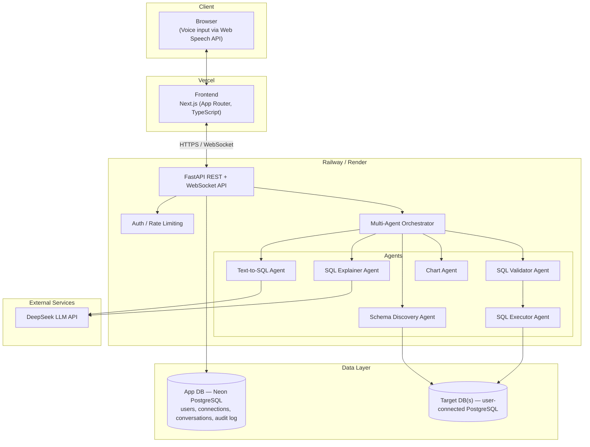
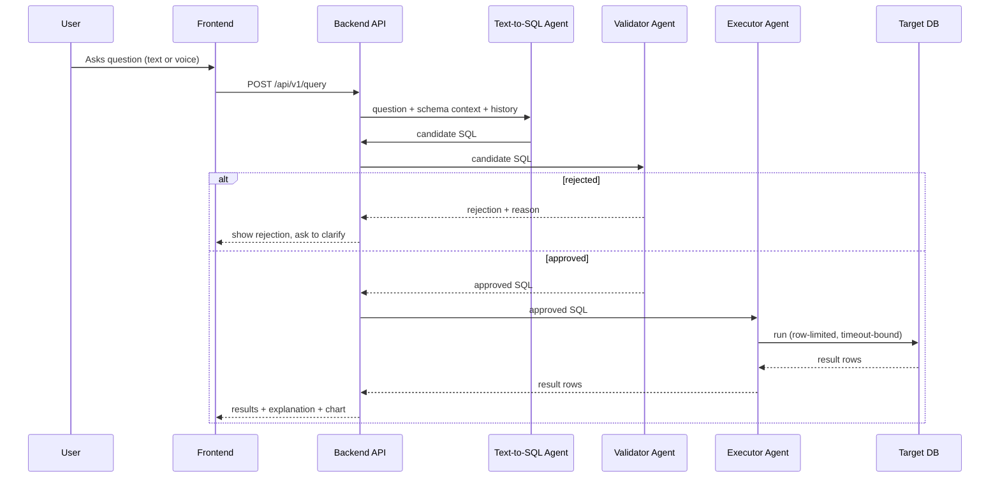

# System Architecture Diagram

Source of truth for DBPilot AI's architecture diagrams. Rendered copies are
embedded in [README.md](../README.md) and [docs/architecture.md](../docs/architecture.md).

## Full System Diagram

## Text-to-SQL Sequence Diagram

## Diagram Conventions

- Diagrams are authored as [Mermaid](https://mermaid.js.org/) so they render
  natively on GitHub without external tooling.
- Keep this file as the single source of truth; copy relevant excerpts into
  `README.md` / `docs/architecture.md` rather than diverging them.
