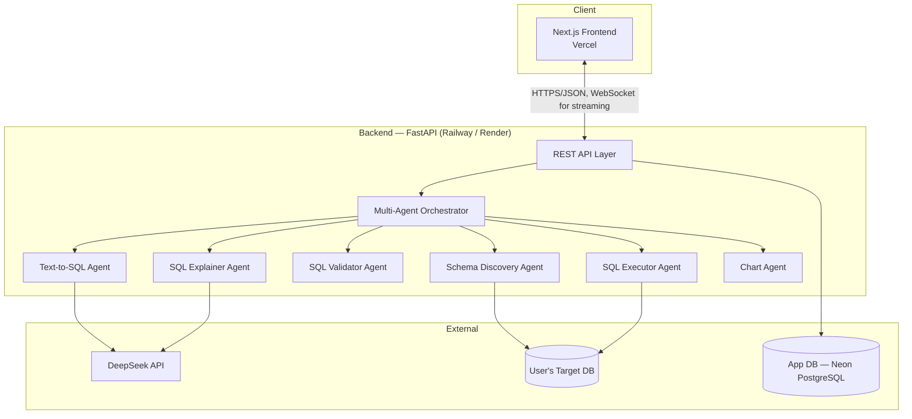

# Architecture

## Overview

DBPilot AI is split into two deployable applications plus a set of
well-defined agent components that live inside the backend:

## Request Lifecycle (Text-to-SQL query)

1. **User asks a question** in the chat UI (optionally via voice input).
2. **Schema Discovery Agent** supplies the relevant, cached schema context
   (tables/columns/relationships) for the connected database.
3. **Text-to-SQL Agent** (DeepSeek) generates a candidate SQL statement using
   the question, schema context, and conversation memory.
4. **SQL Validator Agent** statically analyzes the statement — blocks
   destructive statements (`DROP`, `DELETE` without `WHERE`, `TRUNCATE`,
   `ALTER`, etc.) unless explicitly authorized, and checks it only touches
   tables the user is permitted to query.
5. **SQL Executor Agent** runs the validated query against the target
   database with a row limit, timeout, and read-only transaction where
   possible.
6. **SQL Explainer Agent** produces a plain-English explanation of the query
   and, optionally, tutor-mode commentary.
7. **Chart Agent** inspects the result shape and proposes a visualization
   when appropriate.
8. The orchestrator streams all of the above back to the frontend as
   structured events.

## Component Responsibilities

| Component | Responsibility | Detail |
|---|---|---|
| Frontend | Chat UI, schema browser, chart rendering, voice input | Next.js, deployed to Vercel |
| API Layer | AuthN/Z, request validation, rate limiting, WebSocket streaming | FastAPI |
| Orchestrator | Sequences agent calls, manages conversation state | See [docs/agents.md](agents.md) |
| Agents | Single-responsibility units (discovery, generation, validation, execution, explanation, charting) | See [docs/agents.md](agents.md) |
| App Database | Stores connections, conversation history, users | Neon PostgreSQL |

## Data Flow & Trust Boundaries

- The **target database** (the database the user wants to query) is treated
  as an external, potentially sensitive system. Credentials are encrypted at
  rest; the executor only ever runs validator-approved SQL.
- The **LLM provider** (DeepSeek) receives schema metadata and user
  questions, but never raw credentials or full result sets beyond what's
  needed to answer follow-up questions — see [docs/security.md](security.md).

## Why a Multi-Agent Design

Splitting generation, validation, execution, and explanation into distinct
agents (rather than one large prompt) makes each step independently
testable, lets the validator act as a hard safety gate that isn't subject to
prompt-injection from the generation step, and keeps failure modes legible —
if a query is rejected, the user sees which stage rejected it and why.

## Related Documents

- [docs/agents.md](agents.md) — per-agent contracts and prompts
- [docs/database.md](database.md) — schema discovery & app database design
- [docs/api.md](api.md) — REST/WebSocket API reference
- [docs/security.md](security.md) — threat model
- [architecture/system-architecture.md](../architecture/system-architecture.md) — diagram source
